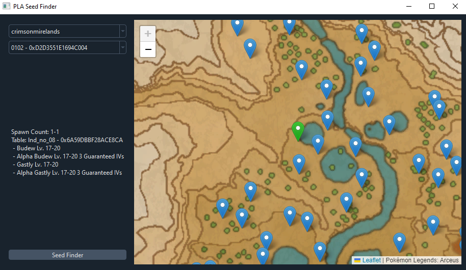
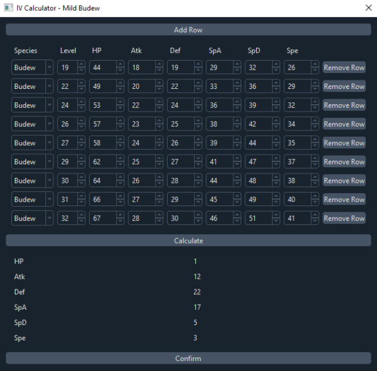
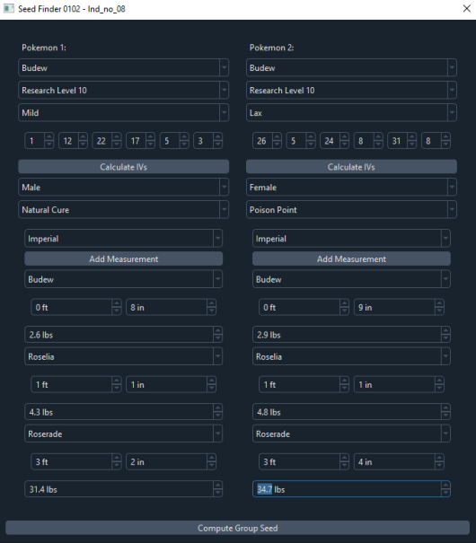
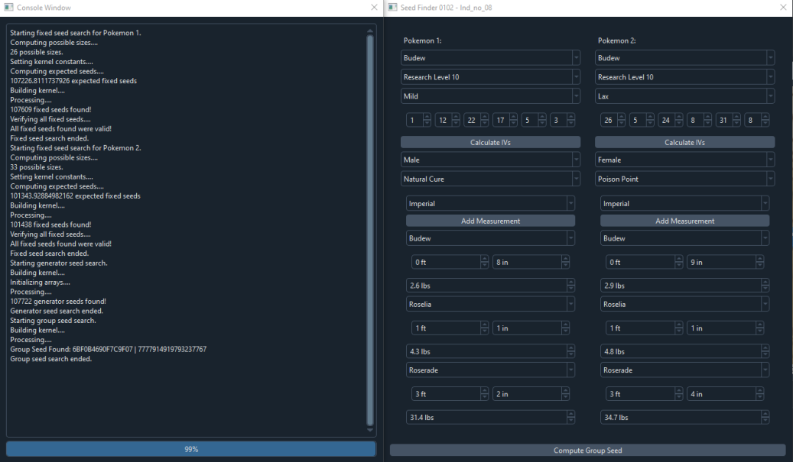
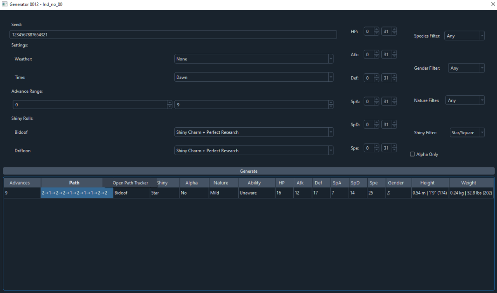
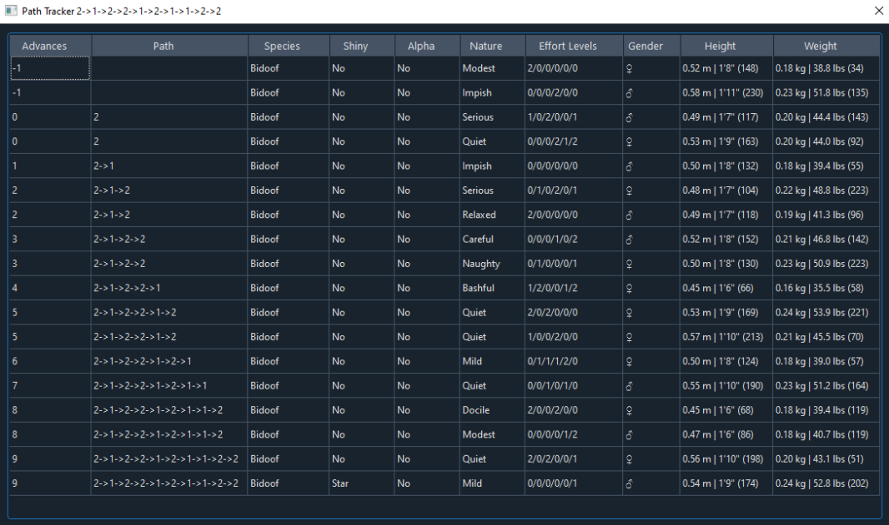

# pla-reverse-gui
PySide6-based GUI for Seed Cracking and RNG w/o CFW assistance in Pokemon: Legends Arceus

## Requires 3.7.2 <= python < 3.11

## pla-reverse-gui relies on the following projects:
- [pla-reverse](https://github.com/Lincoln-LM/pla-reverse) as the core for seed cracking computations
- [numba_pokemon_prngs](https://github.com/Lincoln-LM/numba_pokemon_prngs) for RNG implementations as well as game resources

# Credits
- pattirudon's [larng-java](https://github.com/pattirudon/larng-java) for the initial implementation of seed cracking
- Serebii's [Pokearth](https://www.serebii.net/pokearth/hisui/) for the map images